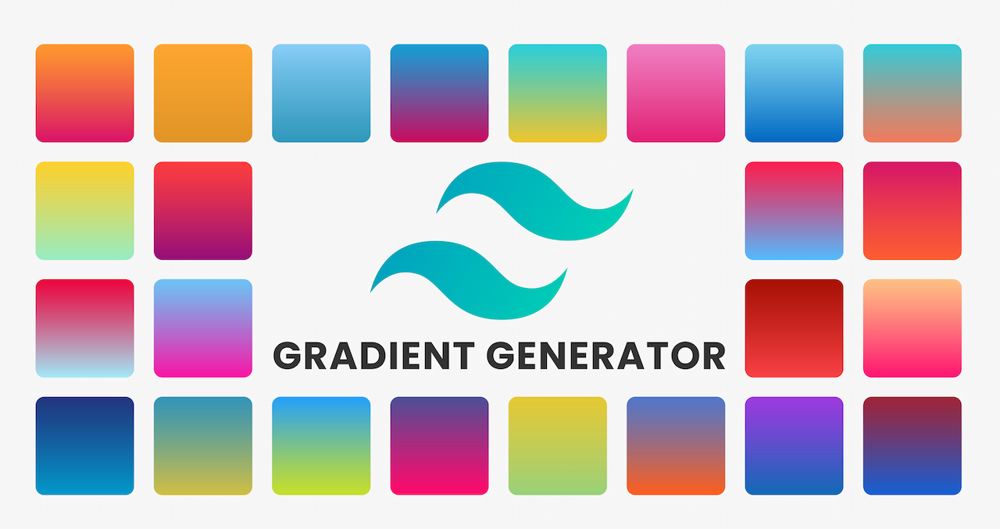

 
 
# Tailwind Gradient Generator

Link: [Tailwind Gradient Generator](https://tailwind-gradient-generator.vercel.app/)

## Donations

<!-- ALL-CONTRIBUTORS-BADGE:START - Do not remove or modify this section -->

<!-- ALL-CONTRIBUTORS-BADGE:END -->

Feel free to collaborate.

## Contributing

Are you interested in contributing to the project? Thank you very much for your interest. We are always looking for improvements to the project and contributions from open source developers are greatly appreciated. If you have a contribution in mind, please see our [Contribution Guide](/CONTRIBUTING.md) for information on how to do so.

## Contributors ✨

Thanks goes to these wonderful people ([emoji key](https://allcontributors.org/docs/en/emoji-key)):

<!-- ALL-CONTRIBUTORS-LIST:START - Do not remove or modify this section -->
<!-- prettier-ignore-start -->
<!-- markdownlint-disable -->
<table>
  <tbody>
    <tr>
      <td align="center" valign="top" width="14.28%"><a href="https://zentreax.dev/"> <b>Zentreaxᴰᵉᵛ</b></a> <a href="#a11y-Zentreax" title="Accessibility">️️️️♿️</a></td>
      <td align="center" valign="top" width="14.28%"><a href="https://github.com/keithmchd48"> <b>Keith Machado</b></a> <a href="https://github.com/roberthgnz/tailwind-gradient-generator/commits?author=keithmchd48" title="Code">💻</a></td>
      <td align="center" valign="top" width="14.28%"><a href="https://www.linkedin.com/in/victor-arnedo-blanco/"> <b>Victor</b></a> <a href="https://github.com/roberthgnz/tailwind-gradient-generator/commits?author=varnebla" title="Code">💻</a></td>
      <td align="center" valign="top" width="14.28%"><a href="https://cesaralvarez.js.org/"> <b>César Álvarez Llaneza</b></a> <a href="https://github.com/roberthgnz/tailwind-gradient-generator/commits?author=cesaralvrz" title="Documentation">📖</a> <a href="#design-cesaralvrz" title="Design">🎨</a> <a href="https://github.com/roberthgnz/tailwind-gradient-generator/commits?author=cesaralvrz" title="Code">💻</a></td>
      <td align="center" valign="top" width="14.28%"><a href="https://github.com/JasonFritsche"> <b>Jason Fritsche</b></a> <a href="https://github.com/roberthgnz/tailwind-gradient-generator/commits?author=JasonFritsche" title="Code">💻</a></td>
      <td align="center" valign="top" width="14.28%"><a href="https://github.com/amimaro"> <b>Amir Zahlan</b></a> <a href="https://github.com/roberthgnz/tailwind-gradient-generator/commits?author=amimaro" title="Code">💻</a></td>
      <td align="center" valign="top" width="14.28%"><a href="https://pantelis.theodosiou.me/"> <b>Pantelis Theodosiou</b></a> <a href="https://github.com/roberthgnz/tailwind-gradient-generator/commits?author=ThPadelis" title="Code">💻</a></td>
    </tr>
    <tr>
      <td align="center" valign="top" width="14.28%"><a href="https://raul-aguilar.netlify.app/"> <b>Raúl Aguilar</b></a> <a href="https://github.com/roberthgnz/tailwind-gradient-generator/commits?author=raulwwq0" title="Code">💻</a></td>
      <td align="center" valign="top" width="14.28%"><a href="https://www.linkedin.com/in/sajidul-kabir-748b57211/"> <b>Sajidul kabir</b></a> <a href="https://github.com/roberthgnz/tailwind-gradient-generator/commits?author=sajidul-kabir" title="Code">💻</a></td>
    </tr>
  </tbody>
</table>

<!-- markdownlint-restore -->
<!-- prettier-ignore-end -->

<!-- ALL-CONTRIBUTORS-LIST:END -->

This project follows the [all-contributors](https://github.com/all-contributors/all-contributors) specification. Contributions of any kind welcome!

### Thanks ❤️

Project strongly inspired in https://gradient-designer.csspost.com by @jenstornell
